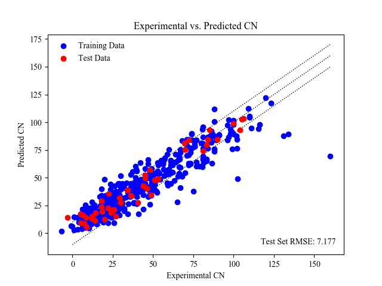

# ECNet Tools

## Database creation

ECNet databases are comma-separated value (CSV) formatted files that provide information such as the ID of each data point, an optional explicit sort type, various strings and groups to identify data points, target values and input parameters. Row 1 is used to identify which columns are used for ID, explicit sorting assignment, various strings and groups, and target and input data, and row 2 contains the names of these strings/groups/targets/inputs. Additional rows are data points.

Our [databases](https://github.com/ECRL/ECNet/tree/master/databases) directory on GitHub contains databases for cetane number, cloud point, kinetic viscosity, pour point and yield sooting index, as well as a database template.

You can create an ECNet-formatted database with molecule names or SMILES and (optionally) target values. The following programs must be installed for you to do so:
- [Open Babel](http://openbabel.org/wiki/Main_Page) software
- [Java JRE](https://www.oracle.com/technetwork/java/javase/downloads/jre8-downloads-2133155.html) version 6 and above

Supplied names or SMILES must exist in a text file, one entry per line:
```
Acetaldehyde
Acetaldehyde dimethyl acetal
Acetic acid
Acetic anhydride
Acetol
Acetone
Acetonitrile
Acetonylacetone
```

If target values are supplied, they must also exist in a text file (of equal length to the supplied names or SMILES):
```
70
147
244
284
295
133
180
376
```

The database can then be constructed with:
```python
from ecnet.tools.database import create_db

create_db('names.txt', 'my_database.csv', targets='targets.txt')
```

If SMILES strings are supplied instead of names:
```python
from ecnet.tools.database import create_db

create_db('smiles.txt', 'my_database.csv', targets='targets.txt', form='smiles')
```

Your database's DATAID column (essentially Bates numbers for each molecule) will increment starting at 0001. If a prefix is desired for these values, specify it with:

```python
from ecnet.tools.database import create_db

create_db('names.txt', 'my_database.csv', targets='targets.txt', id_prefix='MOL')
```

## Chemical file/format conversion

ECNet has a variety of tools for converting chemical files/formats:

### Molecule name to SMILES string

```python
from ecnet.tools.conversions import get_smiles

smiles = get_smiles('Molecule Name')
```

### SMILES string to MDL Molfile

A text file containing SMILES strings, one per line, is required:

```
CC1=CC=C(O1)C(C2=CC=CO2)C3=CC=C(O3)C
CCCCC1=CC=CO1
C1CCOCC1
CC1=CC=C(C)O1
C1C=CCO1
```

```python
from ecnet.tools.conversions import smiles_to_mdl

# An MDL file is generated
smiles_to_mdl('smiles.txt', 'molfile.mdl')
```

Note that [Open Babel](http://openbabel.org/wiki/Main_Page) is required to execute this function.

### MDL to QSPR descriptors

An existing MDL file is required, as well as an installation of [Java JRE](https://www.oracle.com/technetwork/java/javase/downloads/jre8-downloads-2133155.html).

```python
from ecnet.tools.conversions import mdl_to_descriptors

# A CSV file with descriptors is generated
mdl_to_descriptors('molfile.md', 'descriptors.csv')
```

## ECNet .prj file usage

Once an ECNet project has been created, the resulting .prj file can be used to predict properties for new molecules. A text file containing names or SMILES strings of new molecules, one per line, is required in addition to the .prj file.

```python
from ecnet.tools.project import predict

# From a names txt file
predict('molecules.txt', 'results.csv', 'my_project.prj', form='name')

# From a SMILES txt file
predict('smiles.txt', 'results.csv', 'my_project.prj', form='smiles')
```

Both Open Babel and the Java JRE are required for conversions.

## Constructing a Parity Plot for Experimental/Predicted Data

A common method for visualizing how well neural networks predict data is by utilizing a parity plot. A parity plot will show how much predictions deviate from experimental values by plotting them in conjunction with a 1:1 linear function (the closer a plot's data points are to this line, the better they perform).

To create a parity plot, let's import the ParityPlot object:

```python
from ecnet.tools.plotting import ParityPlot
```

And initialize it:

```python
my_plot = ParityPlot()

# The plot's title defaults to `Parity Plot`; let's change that:
my_plot = ParityPlot(title='Cetane Number Parity Plot')

# The plot's axes default to `Experimental Value` (x-axis) and `Predicted Value`
#   (y-axis); we can change those too:
my_plot = ParityPlot(
    title='Cetane Number Parity Plot',
    x_label='Experimental CN',
    y_label='Predicted CN'
)

# The plot's font is Times New Roman by default; to use another font:
my_plot = ParityPlot(
    title='Cetane Number Parity Plot',
    x_label='Experimental CN',
    y_label='Predicted CN',
    font='Calibri'
)
```

Now that our plot is initialized, we can add data:

```python
my_plot.add_series(x_vals, y_vals)
```

Say, for example, we obtained results from ECNet's Server object using the "use" method; let's plot predicted vs. experimental for the test set:
```python
'''Let's assume you've trained your model using a Server, `sv`'''

# Obtain predictions for data in the test set:
predicted_data = sv.use(dset='test')
experimental_data = sv._sets.test_y

# Pass the test data's experimental values and its predicted values:
my_plot.add_series(experimental_data, predicted_data)

# We can also asign a name to the series, and change its color:
my_plot.add_series(
    experimental_data,
    predicted_data,
    name='Test Set',
    color='red'
)
```

Multiple data series can be added to your plot, allowing you to visualize different data sets together.

If we want to visualize how well given data points perform with respect to an error metric, we can add error bars to the plot. These error bars are placed on the positive and negative side of the 1:1 parity line:

```python
'''Let's assume you've trained your model using a Server, `sv`'''

# Obtain the test set's RMSE:
errors = sv.errors('rmse', dset='test')

# Add the error bars:
my_plot.add_error_bars(errors['rmse'])

# We can show the value of the error by supplying:
my_plot.add_error_bars(errors['rmse'], label='Test Set RMSE')
```

Once the plot is complete, it can be saved:

```python
# Save the plot to `my_plot.png`:
my_plot.save('my_plot.png')
```

Or, we can view it without saving:
```python
# View the plot in a pop-up window:
my_plot.show()
```

Here is what plotting cetane number training and test data looks like:


